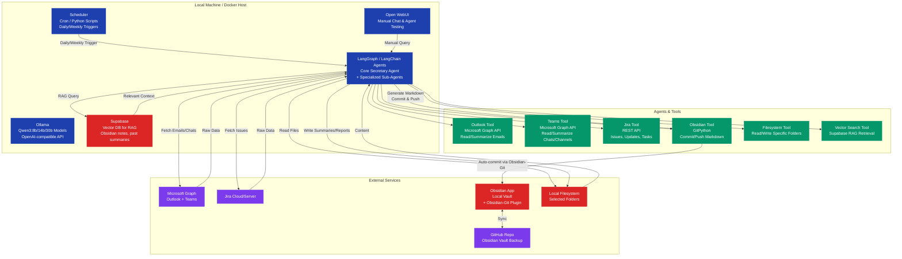
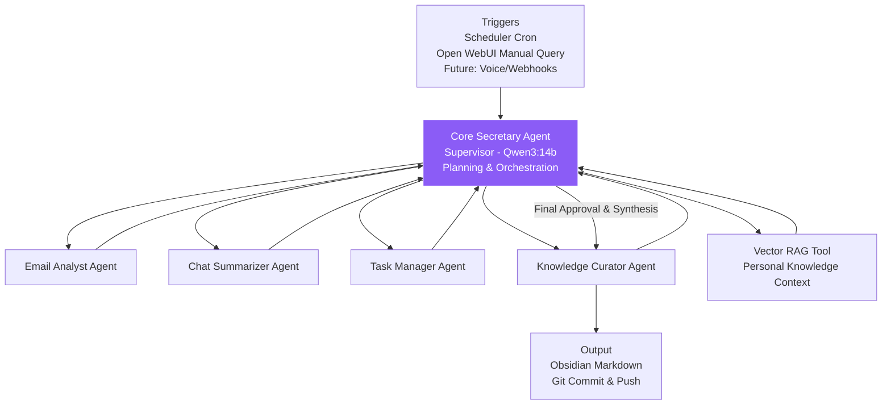

# local-ai-lab

# Final(ish) Version 1.0

## High Level Topology

```
[Local Machine/Docker Host (Still determining between one or multiple hosts.]
├── Ollama (Qwen3 models: 8b/14b/30b-MoE) (Possibly smaller models for sumarization if needed)
│   └── OpenAI-compatible API endpoint (http://localhost:11434)
├── Open WebUI → Chat interface to query llm, open web, and agents manually
├── Supabase → Vector DB for RAG (embeddings from notes/emails)
├── LangGraph/LangChain Agents (Python app/container) 
│   ├── Core Agent: "Secretary" (reasoning + tool router)
│   ├── Specialized Sub-Agents (CrewAI-style roles):
│   │   - Email Analyst (Outlook)
│   │   - Chat Summarizer (Teams)
│   │   - Task Manager (Jira)
│   │   - Knowledge Curator (Obsidian/GitHub/Filesystem) (other tools later like sharepoint & interal tooling)
│   └── Tools:
│       - Microsoft Graph API (emails/calendars/Teams channels)
│       - Jira REST API (issues/search)
│       - GitPython (commit/push to Obsidian repo)
│       - Filesystem read/write
│       - Vector search (Supabase)
├── Scheduler (cron/Python scripts)
│   ├── Daily/weekly runs: Fetch → Analyze → Summarize → Write to Obsidian
│   └── Triggers: Webhooks (if possible) or polling
└── Output: Obsidian Vault (synced to GitHub via Obsidian-Git plugin) & quite obviously Open Web UI.
```




## Core Secretary Agent



