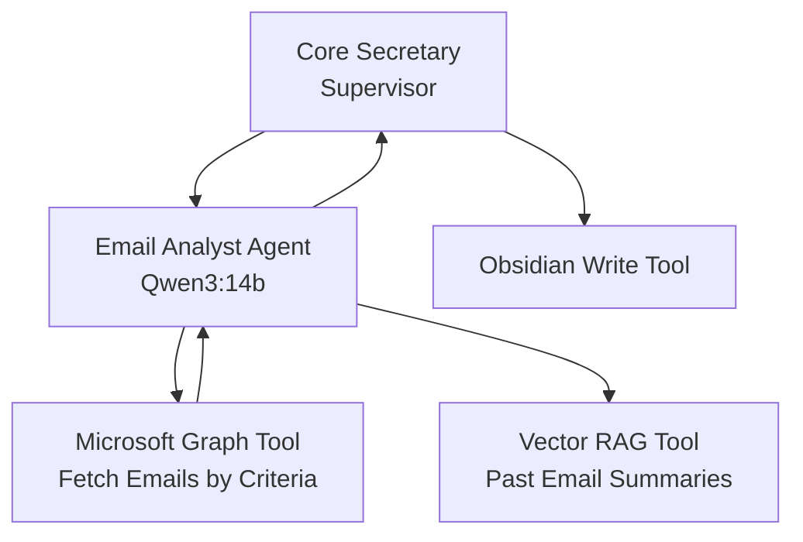

# Local AI Secretary

**Purpose**:
- Provide an LLM & interface to quickly and intelligently query local and remote data (open web, local sensitive data, and internal work data)
- Automate knowledge work and information gathering to construct and query a Personal Knowledge Base (focused primarily on Career/Work domains)
- Generate (daily, weekly, monthly, quarterly, and annual) sumamrizations, analysis, action identification, and reports of email, chat, and Jira work.
- Provide an interface into Obisidan to intelligently interact with the content.
- Provide an in interface into
- Interface with internal work tools/APIs/Websites and codesbases to easily and intellignetly provide inforamation, explainations, and insight.
- Assist with streamlining team/product/project management and documentation 

## Possibility Assessment & Proof-of-Concept
*Initial core concept learning, capability assessment, knowledge gap identification, requirements gathering, resource testing, techh analysis, and POC build.**
---

### [POC] Technology Stack
- Docker ()
- Docker Compose () *Will most likely not use in produciton. Will transition to Kubernetes accross multiple devices*
- Docker Desktop () *Will most likely not use in production*
- Ollama (LLM Platform)
- Qwen0.6b (Testing Model. Severely too limited for prod use in any capacity)
- Open webUI (User Interface)
- SearXNG (Internet Metasearch Engine)
- N8N (Low-Code general purpose automation & agent/workflow testing with prebuilt integrations) *Will be replaced by LangGraph LangChain most likely*
- Flowist (AI workflows & agents)
- Supabase (Baas Postgress DB, auth, feil storage, edge, ai/vector) *May be outside of the POC scope due to resource needs*
- Qdrant (Vector database & similarity search engine)
- Neo4j (Graph DB)
- Langfuse (Observability for LLM applications)

### [POC] Agents/Workflows
- Internet Search
- Notes Summarization (Requires Filesystem access or Repo Access)
- Email Summarization (Multiple based on time/date provided)
- MS Teams Summarization (Multiple Channels & Chats)

## MVP
---

### [MVP] Technology Stack
- Docker ()
- Kubernetes
- Ollama (LLM Platform)
- Qwen 14b
- Open webUI (User Interface)
- SearXNG (Internet Metasearch Engine)
- N8N *If still applicable after LangGraph/LangChain*
- LangGraph
- LangChain
- Flowist (AI workflows & agents) *If still applicable after LangGraph/LangChain*
- Supabase (Baas Postgress DB, auth, feil storage, edge, ai/vector) *May be outside of the POC scope due to resource needs*
- Qdrant (Vector database & similarity search engine)
- Neo4j (Graph DB)
- Langfuse (Observability for LLM applications)

## High Level Topology

Local Infrastructure (1 Host or multiple for resource optimization)
- Ollama (LLM runner)
    - Qwen3 models: 8b/14b/30b-MoE (depending on agent needs & UI needs)
    - OpenAI-compatible API endpoint (localhost:11434)
 - Open WebUI: Web UI & Chat interface to query LLM directly adn agents directly/manually
 - Supabase: Vector DB for RAG (embeddings from notes/email)
 - LangGraph/LangChain Agents (Python app/container) (Deviating from n8n for limitaitons)
    - Core Agent "Secretary": Reasoning and tool router
    - Specialized sub-agents (crewAI-style roles):
        - Email Analyst (Outlook)
        - Chat Summarizer (MS Teams)
        - Taks Manager (Jira)
        - Knowledge Curator (Obsidian, Github, Filesystem)
    - Tools
        - MS Graph API (Email, Calendar, Teams)
        - Jira REST API (issues/search/jql)
        - GitPython (commit/push  to github, specifically Obsidian repo)
        - Filesytem read/write
        - Vector search (supabase)
    - Scheduler (Cron / Python scripts)
       - Daily/Weekly runs: Fetch, Analyze, Summarize, and then write to obsidian report.
       - Triggers (if needed)
- Output: Obsidian Vault (Github Repo via Obsidian-Git plugin) or Open WebUI interface
      

## Core Secretary Agent

## Agent Topology (Email Analysis)

